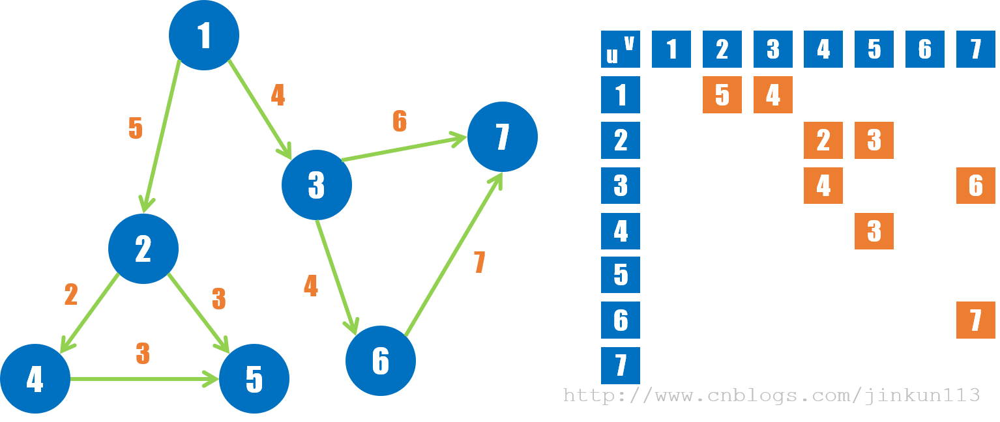
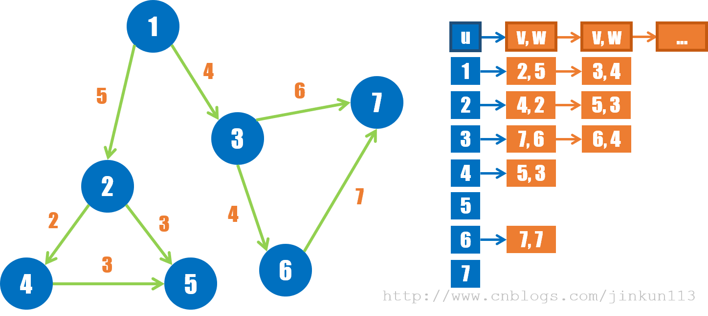

<!--
 * @Author: xingzheng
 * @Date: 2021-07-18 23:41:53
 * @LastEditTime: 2021-07-18 23:43:45
 * @LastEditors: Please set LastEditors
 * @Description: In User Settings Edit
 * @FilePath: /Job/algorithm/graph.md
-->

# 图

## 图的存储（优点缺点）

### 邻接矩阵

二维数组存储

**优缺点**

- 能在O(1)时间内查找边
- 空间浪费，特别是在稀疏矩阵但情况下

### 邻接表

链式存储

## 图的遍历算法

### 狄杰斯特拉算法

1. 初始时，S只包含起点s；U包含除s外的其他顶点，且U中顶点的距离为”起点s到该顶点的距离”[例如，U中顶点v的距离为(s,v)的长度，然后s和v不相邻，则v的距离为∞]。
2. 从U中选出”距离最短的顶点k”，并将顶点k加入到S中；同时，从U中移除顶点k。
3. 更新U中各个顶点到起点s的距离。之所以更新U中顶点的距离，是由于上一步中确定了k是求出最短路径的顶点，从而可以利用k来更新其它顶点的距离；例如，(s,v)的距离可能大于(s,k)+(k,v)的距离。
4. 重复步骤(2)和(3)，直到遍历完所有顶点。

**正确性**

- 对于距离最短的顶点K，路径中不存在未被遍历的节点
- 为什么当前值一定是最短的？对于已经遍历的节点，可能存在条可达的路径，但对于其中的每一个节点来说，都是最短的，在算法运行的过程中，已经进行了n次比较（可达路径）得到的最小值，因此此为当前节点的最小值。