# part-time Job
## Bytedance - tiktok 
- timeline: 2021/05/26 ～ 2021/08
### 技术栈

- 语言：Golang、thrift
- 存储：Mysql、ES、Redis
- 框架：Gin、Gorm
- 中间件：RMQ
- 架构：微服务

### workList

#### 新增直播回放管理页

核心要点：

1）直播回放，商家后台管理能力，支持自定义选择展示直播片段以及是否开启商详展示

技术实现：

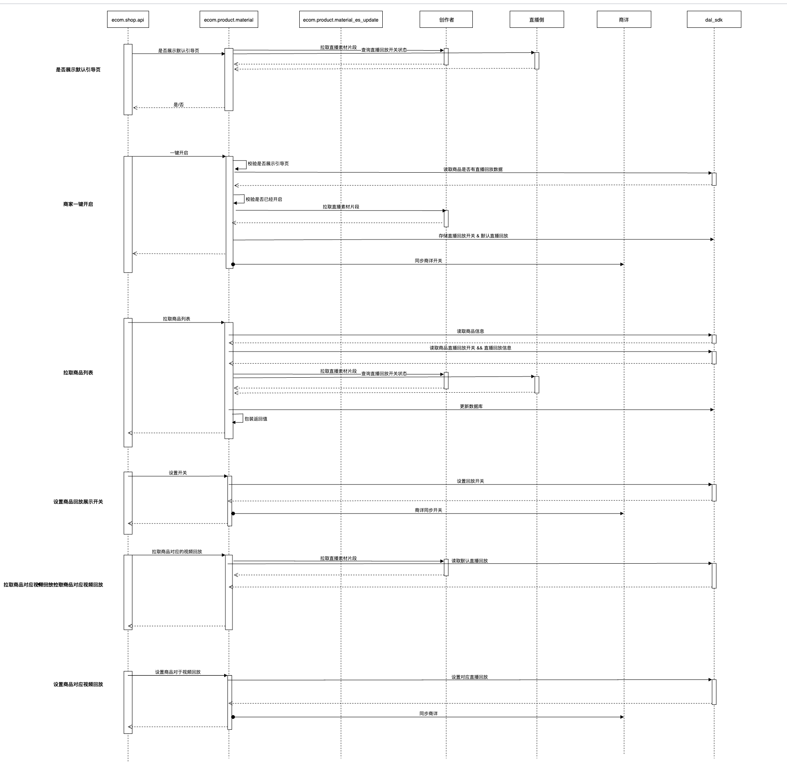

#### 新增白底图采集

##### 核心需求：

1）**商品创建、修改**：新增非必填白底图，支持上传修改

2）**商品详情页**：白底图审核通过则显示，不通过显示原因

3）**商品管理**：素材驳回不影响商品状态，管理列表提示素材图被驳回，支持编辑修改后重新送审

4）**历史兼容与可拓展性**：部分复用此前头图视频的逻辑与接口，需要考虑之后可能出现1:N 的其它类型的素材图

##### 技术实现：

-  创建修改：增加传入和传出的参数，逻辑上不复杂。但是由于商品信息与数据进行了解耦合，所以要进行判断。
- 审核状态流转：商品送审、取消审核、审核回调与结果处理。审核回调使用的监听MQ消息，然后消费者服务调用backend服务进行处理。相关审核记录信息存储来源信息中，回调时候读出。
- 复用头图视频整体逻辑：数据库表中增加一个type类型。

#### 价格校验逻辑优化

##### 校验逻辑

**核心逻辑变更**：先调用营销接口判断是否命中阻断逻辑，若命中直接返回。调用治理侧接口，判断是否有警告。调用营销接口，判断是否有警告。

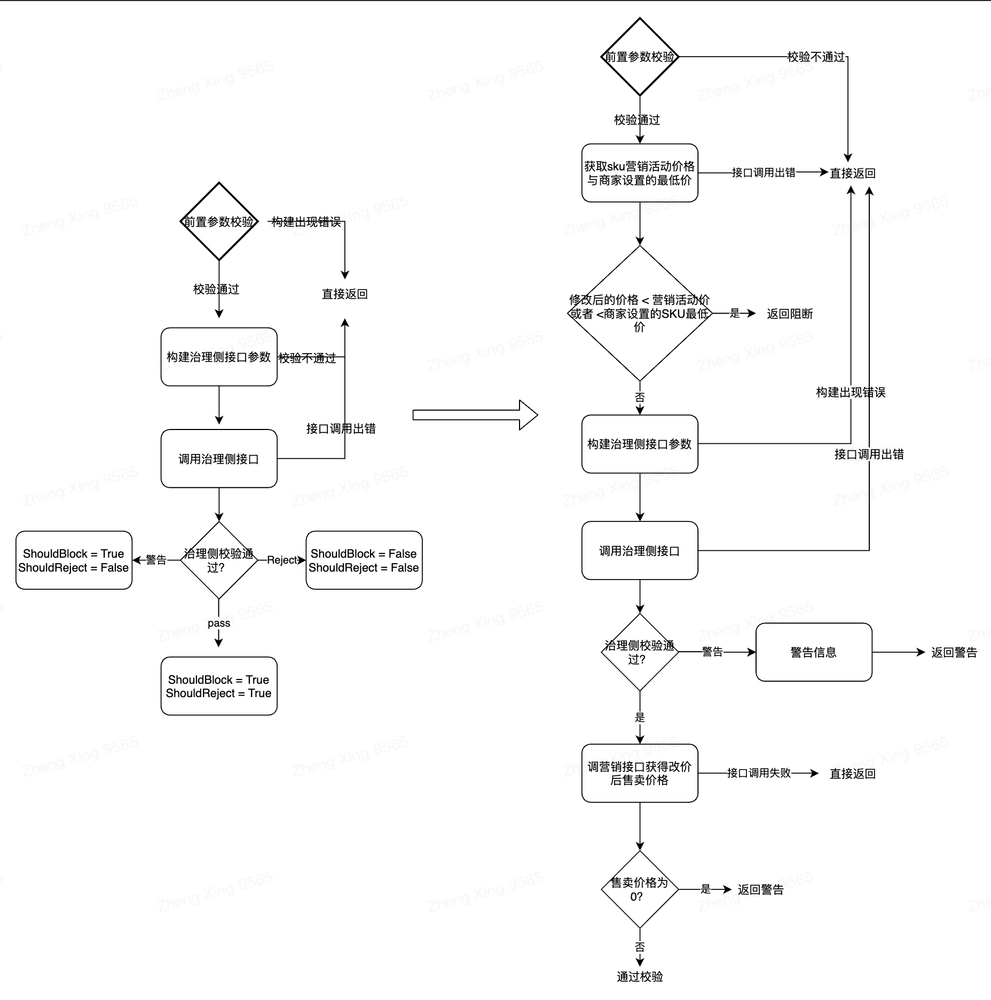

##### 代码实现

- 前置校验：用户在改价失焦之后会触发，调用校验接口，如上图所示
- 后置校验：嵌套在各项逻辑之中，函数接受interface，然后使用switch type转换为原来的参数，最后调用一个闭包函数来处理，优点在于省略了冗长的参数传递


#### 增加字段支持-MarketPrice & Status & checkStatus & draftStatus

##### 核心需求点描述

1）ecom_tc_product_change 中type = 4 & type =15 消息中加上MarketPrice字段

2）商品变更消息中增加Status部分

##### 技术方案

营销侧主要监听的Topic是ecom_tc_product_change，消费消息类型主要为：4，5，6，7，8，9，10，11，15。product_backend不发送type=15消息。product_draft发送type=4 & 15 消息。

消息体中加内容，RMQ


#### 卡券信息特殊符号兼容

- 兼容缓存中特殊字符校验

##### Bug追因&方案

老版参数过滤使用https://golang.org/pkg/net/url/#QueryUnescape，不会转义&amp; 而新使用的https://golang.org/pkg/html/#UnescapeString 会将其转义为 & 字符。因此对于存量的数据来说，在匹配时候会出错，因此解决方案为再读取存量数据的&amp；之后，使用UnescapeString 再次进行转义。

Bug修复后，修改提交后脏数据会被刷新。

##### Bug复现

productID：3488795137948184860、shopID：1111115522

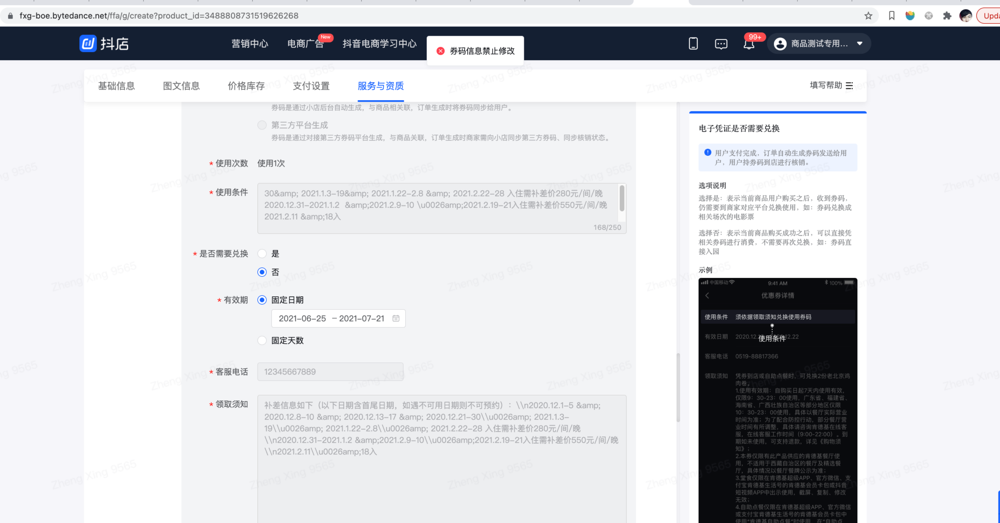


##### BUG修复

修改一行代码，使用html.UnescapeString过滤

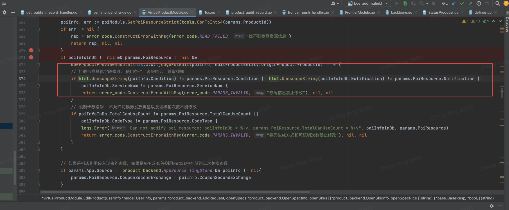

结果如下：

未做修改后提交，发布成功。脏数据被刷新

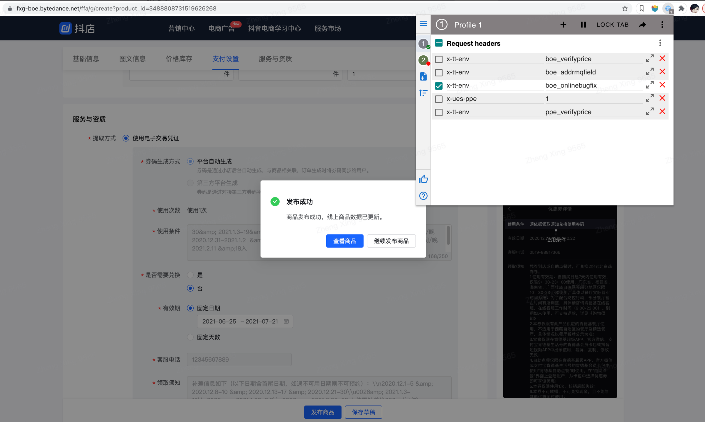

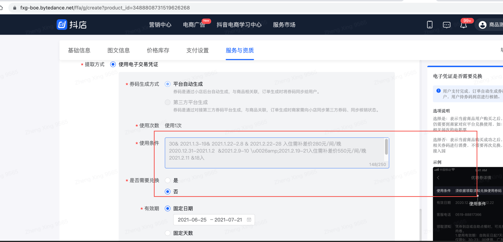

#### FIX-无发布记录时，审核中无法撤销

##### 原因追溯

- 修改商品提交，商品进入审核中流程
- 终端删除t_product_publish_record对应发布记录

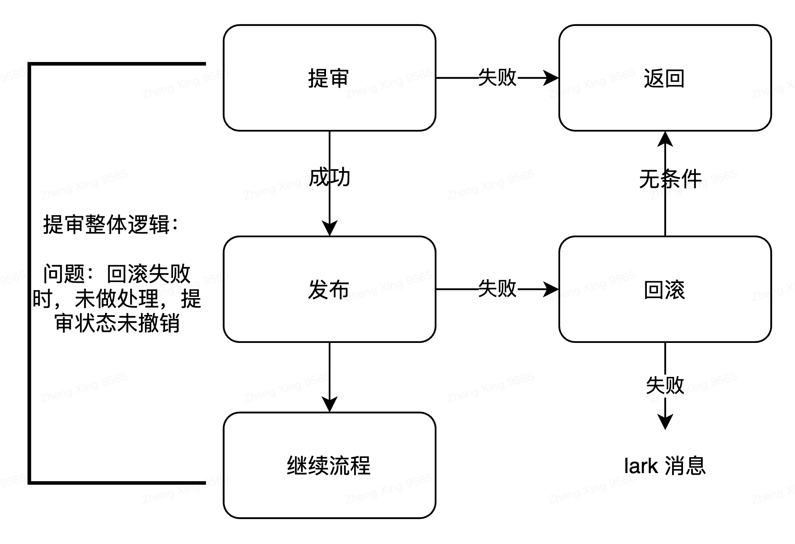

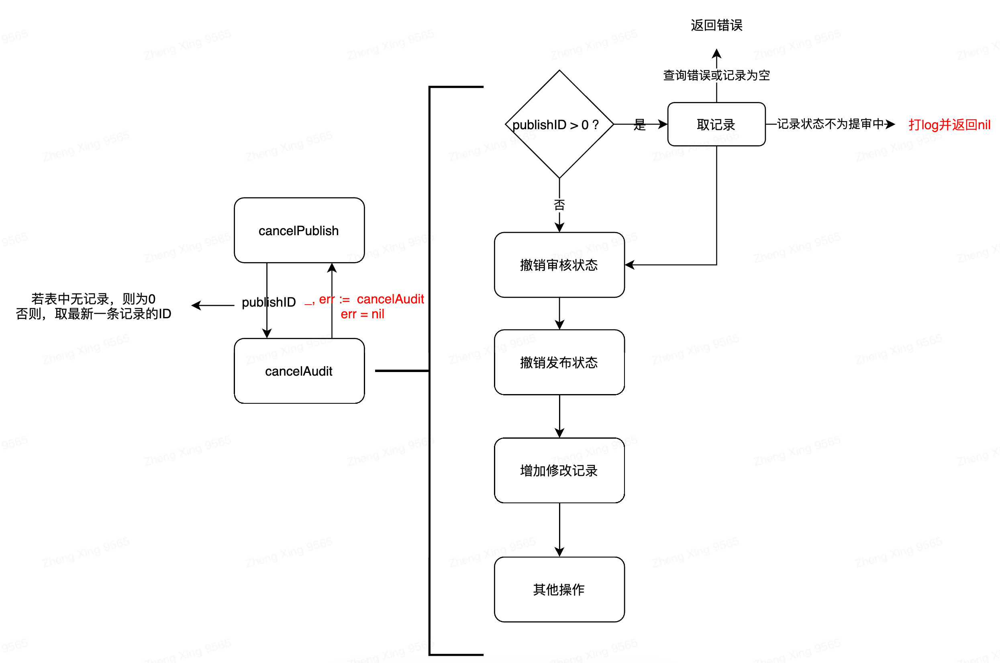

**存在两种情况：**

1. 新建商品审核中：publishID = 0**。此时并不会命中条件判断，直接进行撤销已提交状态。 问题在于前端界面无直接撤销方法，**可下架再上架，如上述图二所示。
2. 修改商品审核中：publishID != 0,  前端可调用CancelPublish方法，命中**红色字体端逻辑，前端返回撤销成功，但实际未执行撤销操作.**

##### 解决方案1:

若无法保证回滚一定成功，则数据状态不一致可能存在。**解决方案**

1. **通过调整CancelAudit逻辑，增加一条判断条件，如下图所示。之前由于会读取到数据库中之前的审核记录，因此会命中记录的发布状态不等于审核中，但由于数据不一致的情况存在，因此需要加上一条，判断在线商品的草稿审核状态不等于草稿已经提交审核。**


1. **前端增加新建商品审核中 撤销审核按钮。**


#### 商品字符校验调整V2

##### 放开字符限制：20 -> 30

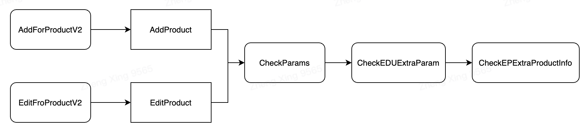

```go
// 标题
if utils.Len(lesson.Title) == 0 {
   return error_code.ConstructErrorWithMsg(error_code.PARAMS_INVALID, "课时标题不能为空")
} else if utils.Len(lesson.Title) > 30 { // fix: 增加课时限制从20 -> 30
   return error_code.ConstructErrorWithMsg(error_code.PARAMS_INVALID, "课时标题不能超过30个字符")
}
```

##### 返回值中存在空值

- 返回值为map类型。遍历map，当val 为空时，删除key

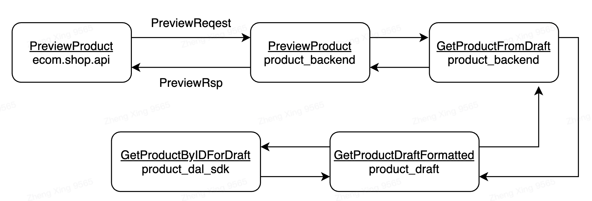

##### 创建或修改时过滤productFormat字段，不允许非法的，传入数据库

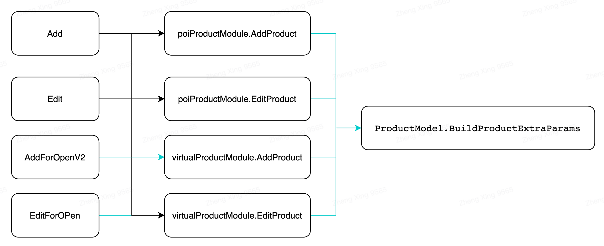

- 新增函数过滤传入值

```go
// 过滤属性值中存在的，，
func (productModel *ProductModel) FilterDot(value string) string {
   valueSlice := strings.Split(value, const_key.PropertyMultiSelectSep)
   var builder strings.Builder

   for i := 0; i < len(valueSlice); i++ {
      if strings.Compare(valueSlice[i], "") != 0 {
         if i != 0 && builder.Len() != 0 {
            builder.WriteString(const_key.PropertyMultiSelectSep)
         }
         builder.WriteString(valueSlice[i])
      }
   }

   return builder.String()
}

// 传入参数校验：防止空字段写入数据库
for _, item := range params.ProductFormat {
   if filterStr := NewProductModel(context.TODO()).FilterDot(item.FormatVal) ; strings.Compare(filterStr, "") != 0 {
      mapStr[item.FormatKey] = filterStr
   }
}
```


