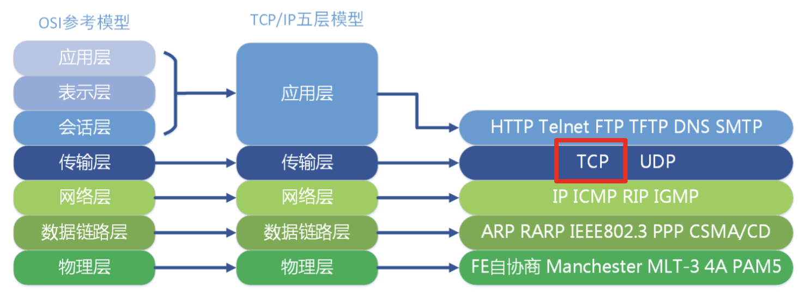
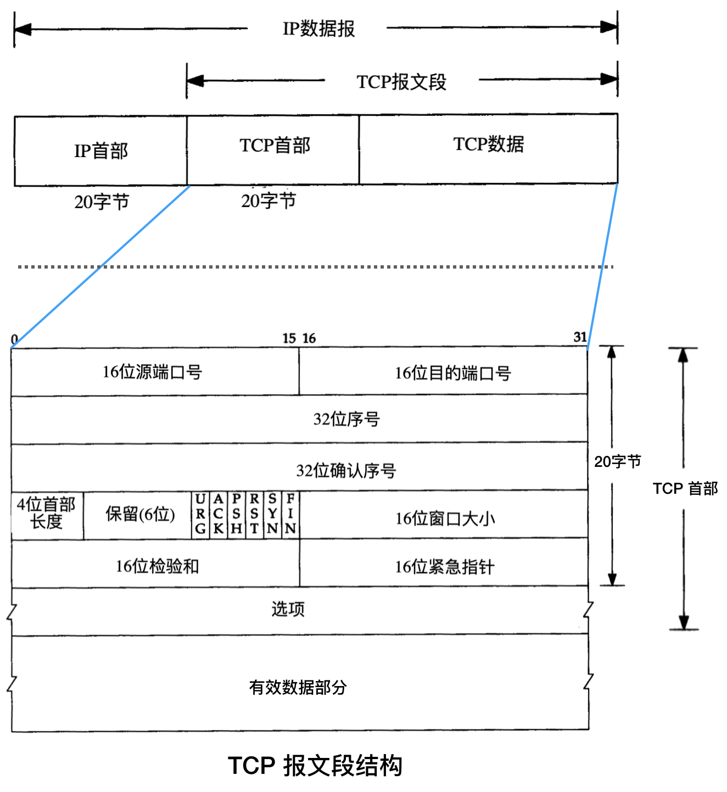
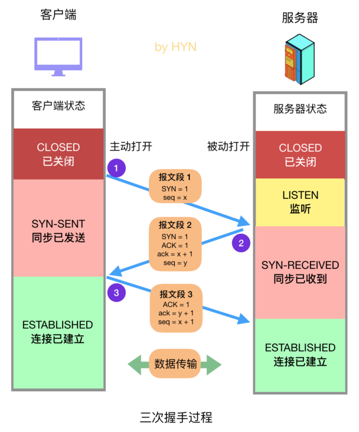
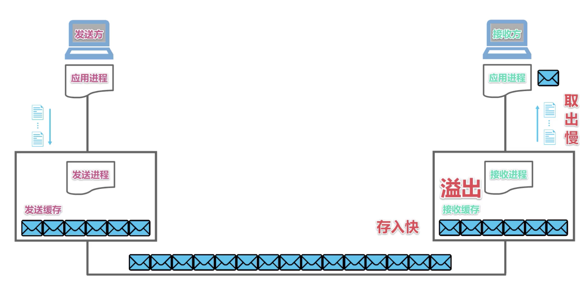
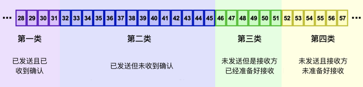
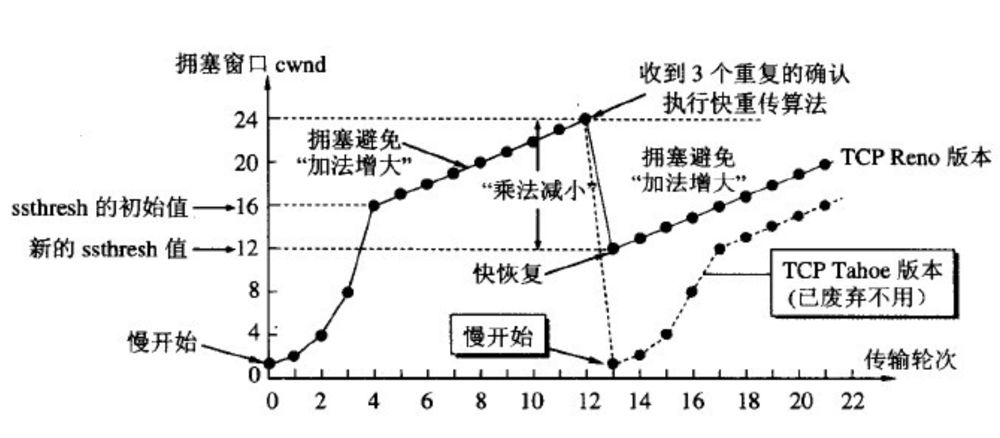

#  Network

## 网络协议及基本概念

### OSI网络模型

七层网络模型：

### TCP/UDP

[tcp知识](https://segmentfault.com/a/1190000022144695)

|              |                    UDP                     |                  TCP                   |
| :----------: | :----------------------------------------: | :------------------------------------: |
|   是否连接   |                   无连接                   |                面向连接                |
|   是否可靠   |  不可靠，没有确认机制、流量控制和拥塞控制  |  可靠，有确认机制、流量控制和拥塞控制  |
| 连接对象个数 | 支持一对一，一对多，多对一和多对多交互通信 |            只支持一对一通信            |
|   传输方式   |                  面向报文                  |               面向字节流               |
|   首部开销   |           首部开销小，固定8字节            |  首部开销较大，最小20字节，最大60字节  |
|   适用场景   |  适用于实时应用(IP电话、视频会议、直播等)  | 适用于要求可靠传输的应用，如文件传输等 |

**TCP报文段格式**

**三次握手**

**四次挥手**

**流量控制**

**拥塞**

#### **为什么tcp需要三次握手**

[为什么tcp需要三次握手](https://draveness.me/whys-the-design-tcp-three-way-handshake/)

**连接的定义**：用于保证可靠性和流控制机制的信息，包括 Socket、序列号以及窗口大小叫做连接。

#### 攻击与防范

##### syn洪范攻击

### DNS

### HTTP

[面试之http](https://www.cnblogs.com/zhaobobo001/p/14432801.html)

### HTTPS

[https详解](https://segmentfault.com/a/1190000021494676)

### RPC

### JWT

#### Socket 函数

## 面经问题

### 说说https的过程，详细问了CA怎么去验证证书

### https中ssl建立连接的过程

### https握手流程

### http1.0 和 2.0

### 大量time_wait解决

- [解决方法](https://www.cnblogs.com/dadonggg/p/8778318.html)

